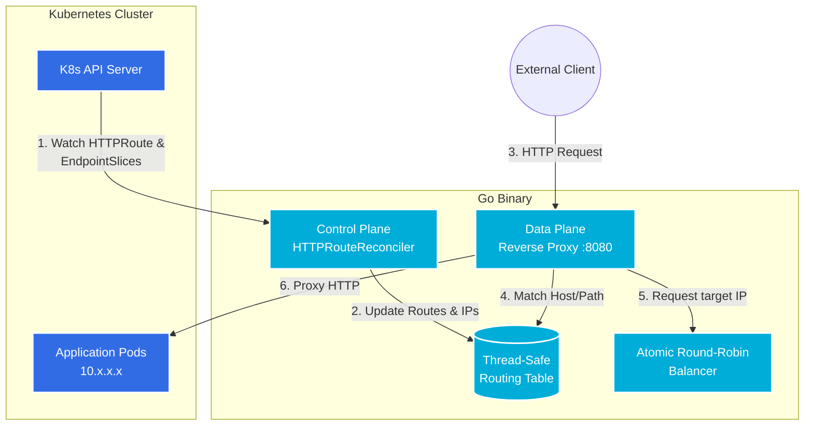

# Kubernetes Gateway API Controller


A lightweight, high-performance Kubernetes ingress proxy that implements the modern **Gateway API** (`HTTPRoute`) standard. 

Unlike traditional controllers that route traffic through `kube-proxy` (via ClusterIPs), this controller bypasses `kube-proxy` entirely. It dynamically watches `EndpointSlices` to discover healthy Pod IPs and load-balances traffic directly to the pod network using an embedded, lock-free reverse proxy.

## ✨ Key Engineering Highlights

*   **Modern Gateway API:** Built around the modern `gateway.networking.k8s.io/v1` specification, future-proofing the routing logic compared to the legacy `Ingress` API.
*   **Kube-Proxy Bypass (Direct Pod Routing):** Resolves routes directly to Pod IPs via `EndpointSlice` resources, eliminating `iptables`/`IPVS` overhead and reducing network latency.
*   **Lock-Free Load Balancing:** Utilizes `sync/atomic` for an ultra-fast, lock-free Round-Robin load balancer in the data plane, ensuring high throughput without mutex contention.
*   **Unified Control & Data Plane:** Combines a `controller-runtime` reconciler (Control Plane) and a `net/http` reverse proxy (Data Plane) within a single static Go binary.

## 🏗 Architecture

The application is logically divided into a **Control Plane** (which talks to the Kubernetes API) and a **Data Plane** (which proxies external traffic). They share a thread-safe state (`RWMutex`).



### 1. The Control Plane (`internal/controller`)
The reconciler watches for changes in `HTTPRoute` and `EndpointSlice` resources. When a change occurs, it re-calculates the topology (Hostnames -> Paths -> Service -> Pod IPs) and atomically updates the shared Routing Table. 
*Note: Using `EndpointSlice` instead of the legacy `Endpoints` API ensures the controller scales efficiently in massive clusters (10k+ pods).*

### 2. The Data Plane (`internal/proxy`)
The proxy listens on port `8080`. For every incoming request, it looks up the requested `Host` and `URL.Path` in the Routing Table. Once the backend service is matched, the atomic Round-Robin balancer selects the next healthy Pod IP, and `httputil.ReverseProxy` streams the request directly to the target container.

## 🚀 Getting Started

### Prerequisites
*   A running Kubernetes cluster (e.g.,[Kind](https://kind.sigs.k8s.io/) or Minikube).
*   The standard Gateway API CRDs must be installed on your cluster:
    ```bash
    kubectl apply -f https://github.com/kubernetes-sigs/gateway-api/releases/download/v1.0.0/standard-install.yaml
    ```

### Deployment

1. **Deploy the Controller:**
   Apply the manifests to create the Namespace, RBAC roles, ServiceAccount, Deployment, and NodePort Service.
   ```bash
   kubectl apply -f deploy/manifest.yaml
   ```

2. **Deploy the Test Application:**
   Spin up a sample Nginx deployment and its corresponding ClusterIP service.
   ```bash
   kubectl apply -f deploy/test-app.yaml
   ```

3. **Configure the Routing (`HTTPRoute`):**
   Apply the Gateway API route to tell the controller to route traffic for `nginx.example.com` to our test app.
   ```bash
   kubectl apply -f deploy/http-route.yaml
   ```

### Verification

Find the NodePort assigned to the Controller's proxy service:
```bash
kubectl get svc morcux-gateway-service -n morcux-gateway-system
```

Send a request explicitly setting the `Host` header to match our `HTTPRoute` rules:
```bash
curl -H "Host: nginx.example.com" http://<NODE_IP>:<NODE_PORT>/
```
You should see the standard Nginx welcome page, successfully proxied through your custom Gateway Controller!

## 📂 Project Structure

```text
.
├── cmd/gateway/main.go               # Entry point, initializes manager & proxy
├── internal/
│   ├── controller/
│   │   └── gateway_controller.go     # K8s Reconciler (Control Plane)
│   ├── proxy/
│   │   ├── round_robin.go            # Lock-free atomic load balancer
│   │   └── server.go                 # HTTP Reverse Proxy (Data Plane)
│   └── state/
│       └── router.go                 # Thread-safe shared routing table
├── deploy/                           # Kubernetes manifests (RBAC, Deployments, CRs)
└── Dockerfile                        # Distroless, static multi-stage build
```

## 📜 License

This project is open-source and available under the MIT License.
